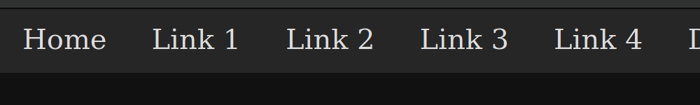
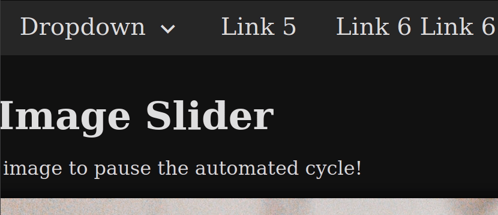

# Dynamic UI Practice

This mini-project combines a few practice projects in one: a dropdown menu, a mobile menu, and an image slider.

## Dropdown/Mobile Menu

I decided to opt for a progressively collapsing menu for the first time. As the window is resized (and upon loading the page), the navbar automatically moves links from the main, visible area into the slightly hidden "more" dropdown menu. 
  

I also implemented a function to "trap the focus" inside dropdown menus when they are expanded, so that keyboard users don't Tab to the rest of the page with a dropdown menu still open.
  
## Image Slider

For the image slider, I added functionality to:
  1. automatically change the image every 5 seconds.
  2. manually change the image by clicking a "next" or "previous" arrow or by clicking a navigational dot below the image.
  3. pause the automated change by clicking the image itself. For keyboard users, this can be achieved by pressing the space or Enter key when the image has focus (when you notice the image has "zoomed in").

Between both the nav bar and the image slider, I attempted to make both accessible. The dropdown items in the nav bar should announce when one is expanded or closed, and I added aria attributes to elements in the image slider itself to announce which arrow is selected or which image dot is focused.